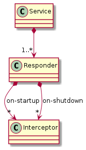
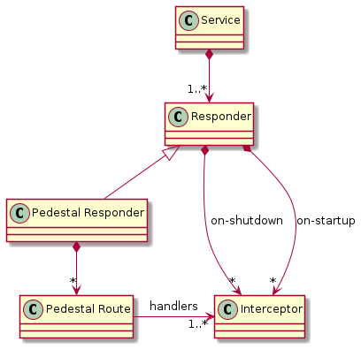
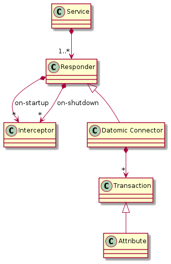

## Concept 1

Premises: 

- We unify various "kinds" of service as "Responders". 
- We use Interceptors for every kind of "extensible processing chain"

Desirable qualities:

- It's easy to see how a Fern configuration can create all the necessary data.
- The execution model and error reporting are the same for startup and request
  handling... at least as far as the developer of the responder and interceptors
  is concerned.

Undesirable qualities:

- The connection from "state created at initialization" to "state used at
  request time" is kind of indirect and not obvious.


### Input Data Model



This is the structure the input file would have. During initialization, more
interceptors can be created.

### Service

A "service" consists of one or more responders.

### Responders

Pedestal is one kind of responder. It listens to an HTTP port, receives requests
asynchronously, and invokes an interceptor chain in response.

A Kafka listener would be another kind of responder. (I've previously built
[such a component](https://github.com/cognitect-labs/pedestal.kafka).)

Other responders that might be added: gRPC, PubSub, AWS Kinesis, or cron.

### Service Initialization

Suppose all of Vase2 starts as one primordial Interceptor.

Namespace: `vase2.init`

`vase2.init/seed` - the primordial interceptor

The primordial interceptor is an internal component in Vase2. It's not available
for direct extension.

The init chain provider provides an input context map with:

- A URL of a Fern file
- A map of environment variables (for configuration)
- A function to report problems

The enter function on the seed expects a URL to a Fern file. It reads the
environment. If successful, then it pushes two interceptors onto the chain:

1. Load any plugins specified in the Fern environment.
2. Evaluate the main service key in the Fern environment.

The seed interceptor's leave function does nothing.

The job of the enter function is to process the input environment and return an
updated context map which may have:

- A list of problems
- A list of 'start' interceptors called `on-startup`
- A list of 'stop' interceptors called `on-shutdown`

The primordial enter function processes the environment and creates the Pedestal
service map. The 'start' interceptors will be called after checking for errors
and before starting the Pedestal service. These 'start' interceptors can modify
the service map.

Question: while processing the primordial enter function, we could push more
interceptors on the current chain. These would be similar to the 'start'
interceptors described here. The main difference is when the
print-errors-and-exit happens. 'start' interceptors would run after
print-errors-and-exit, so anything that would cause them to error should be done
first. Does that leave anything meaningful to do in them?

The primordial 'leave' function does nothing.

#### Init chain provider

The init chain provider (that's Pedestal's term for 'something that runs an
interceptor chain) would be the part to check for errors and exit.

So we would start with:

Fern URL |                       | on-startup
Env vars |--> Primordial enter --| on-shutdown
Errf     |                       | problems

`vase2.init/init` - Function to assemble the initial context, invoke the seed
interceptor, process errors, and invoke the on-startup interceptors. Returns a
map of the service's state.

Is this better than just having a `start` and `stop` function in a
namespace?

One advantage is that literals in the Fern environment can push interceptors
onto the current chain. This would allow extension to start time processing.

### Setting up Responders

Each responder would start as a `(fern/lit xxxx)` form in the Fern file. The
body of the literal is defined by the responder.

If the literal returns an associative value with keys `on-startup` or
`on-shutdown` then the value of those keys are conjed to the end of the current
`on-startup` and `on-shutdown` values. This allows responders to have their own
initialization and shutdown processing.

### Initialization tree

In effect, there is a two-level tree of `on-startup` interceptors:

- Level 1, specified directly in the `vase/service` map in the Fern file
- Level 2, returned in the value of the responder's literal

Error reporting and early exit happens after Level 1 is done. ("Done" here means
that the `on-startup` interceptors have had their `enter` and `leave` functions
called.)

### Deferred Cleanup

If a responder's startup interceptor acquires resources that need to be
released, it should push an `on-shutdown` interceptor to release those
resources. Thus, the on-shutdown interceptors should grow only as the startups
succeed. The shutdown interceptors will be called in the order they are pushed
and the shutdown chain provider will call both their `enter` and `leave`
functions.

If the order of cleanup is important, then the `leave` function is the better
place for it.

Imagine a responder `Sample` that needs both a socket and a database connection.
It would first appear in a Fern file like this:

```
{vase/plugins [com.example.sample]
 vase/service {:sample-responder (fern/lit sample {:db-conn-spec @db
                                                   :port 8181})}}
```

At startup time, the seed interceptor will evaluate `(fern/lit sample
,,,)`. That would return a map with two interceptors in `on-startup`:

```
{:on-startup [DbConn{,,,} Listener{,,,}]}
```

(I'm making up these names for DbConn and Listener. They aren't real, just meant
to convey the idea of interceptors provided by the sample plugin.)

After the database connection is established, that interceptor would want to
push a cleanup interceptor to `on-shutdown`:

```
{:on-startup [DbConn{,,,} Listener{,,,}]
 :on-shutdown [DbConnFree{,,,}]}
```

When instantiating the DbConnFree interceptor (it's just as imaginary as the
others in this example), DbConn's `enter` function would close over the
connection object so it is available at shutdown time... regardless whether that
shutdown happens in a couple of milliseconds or days.

The Listener's `enter` function would also want to push a shutdown interceptor
to close the socket. After executing that, we'd see

```
{:on-startup [DbConn{,,,} Listener{,,,}]
 :on-shutdown [DbConnFree{,,,} CloseSocket{,,,}]}
```

If we put the cleanup code in the `enter` function of DbConnFree and CloseSocket
then resources would be freed in the same order as allocation. In this case it
doesn't matter if the server socket closes before or after the database
connection. In many cases though, we would want to close resources in the
reverse order from opening. Putting the resource free in the `leave` function of
the resource interceptors achieves that.

### Logging, Metrics

Too many logging frameworks. Too many metrics frameworks.

We will have a default, but allow the user to override it. Maybe the way to
handle that is an interceptor in the initial startup chain to "activate" the
right logging & metrics namespace?

### Supporting Datomic and Pedestal

In this concept, a Pedestal server would be a kind of responder. The input data
model would have the server configuration, routes, and interceptors needed.



Likewise, a Datomic connection would be another kind of "responder". In this
case it doesn't really respond to anything... perhaps a name change is needed.
Or perhaps the concept of Responder is complected?



The Datomic responder uses an `on-startup` interceptor to connect to the
database. If successful, it pushes a cleanup interceptor into the `on-shutdown`
chain. If unsuccessful, it reports a problem.

The Datomic responder has some additional data: a list of transactions to apply
at connection time. These are the database migrations we'd see in other
frameworks. Transactions can be spelled out in the long form, or if they are
strictly defining attributes, they can use a compact notation offered by a
literal. The responder uses an `on-startup` interceptor to transact this data.

It is common for an interceptor in a Pedestal route to need state such as the
Datomic connection. In the Fern input, this could look like this:

```
{vase/service {:responders [@datomic @pedestal]}
 datomic      (fern/lit DatomicConnection {,,,})
 pedestal     (fern/lit PedestalServer    {:api [@petstore]})
 petstore     (fern/lit Api               {:on-request [@datomic] :routes @rts})
 rts          #{["/pets" :get [@pets-get]]}
 pets-get     ;; some interceptor that uses the database
 }
```

(Please don't copy this style... I've compacted everything to make a small
example of the linkages.)

The `on-request` interceptor chain in the `petstore` API indicates that those
interceptors get prepended to every chain.

#### Pedestal's Default Interceptors

Inside Pedestal, there is an idea of default interceptors. If you don't define
anything special at the level of the Pedestal server, these are the ones you
get. It's a common complaint of mine that it's too hard to get some-but-not-all
of the default interceptors. Vase2 can expose these by injecting them into the
Fern environment with "magic" names. Perhaps something like
`io.pedestal.http/default-interceptors`. This way a Pedestal server could either say:

```
;; Use the default interceptors, implicitly
{server1  (fern/lit PedestalServer {:port 8080
                                    :routes #{[]}})}
```

or

```
;; Use all the default interceptors, explicitly
{server1  (fern/lit PedestalServer {:port 8080
                                    :routes #{[]}
                                    :on-requeset @io.pedestal.http/default-interceptors})}
```

Or it could use just some of them

```
{server1 (fern/lit PedestalServer {:port 8081
                                   :routes #{[]}
                                   :on-request [@io.pedestal.http/log-request
                                                @io.pedestal.http/not-found
                                                @io.pedestal.http/json-body]})}
```

(This exists today in Vase1, but is not really documented.)